# System Design: Ask Dexter Tauri v2

## 1. Introduction and Scope

This document provides the detailed system design for the Ask Dexter Tauri v2 desktop application. It maps every feature to its owning system components, defines all inter-process communication contracts, specifies data flows, and documents the operational infrastructure required to run the application.

**Relationship to Technical Specification**: This document extends `technical_specification.md` with implementation-level detail. The technical specification defines *what* was decided (ADRs, data model, risk mitigations). This system design defines *how* each subsystem is built, connected, and operated.

**Audience**: Implementation agents, systems engineers, and technical reviewers building or auditing the Tauri v2 codebase.

---

## 2. System Component Inventory

Every system component in the application, with its owning crate/technology, responsibility, and delivery phase.

### 2.1 Rust Backend Services (In-Process)

| Component | Crate / Technology | Responsibility | Phase |
|-----------|-------------------|----------------|-------|
| **EntitlementService** | `jsonwebtoken`, `security-framework` | Offline JWT validation with embedded RSA public key, macOS Keychain read/write for API keys and secure timestamps, clock rollback detection, tier gating (Free/Paid/One-Time). | 3 |
| **DatabaseLayer** | `rusqlite` (bundled) | Single SQLite connection behind `tokio::sync::Mutex`, WAL mode, migration runner, all CRUD operations for User, Conversation, Message, KnowledgeBase, KnowledgeFile, KnowledgeChunk, McpServer, UserSkill, GraphNode, GraphEdge, EntitlementLease, AppSettings tables. | 2 |
| **VectorStore** | `lancedb` | Embedded vector storage and similarity search. Manages Lance-format tables on disk. IVF-PQ index for ANN queries. Linked to KnowledgeChunk rows via `embedding_id`. | 2 |
| **GraphEngine** | `rusqlite` (recursive CTEs) | Property graph operations on `graph_node` and `graph_edge` tables. Recursive CTE queries for 1–3 hop traversals. Entity extraction orchestration. | 2 |
| **McpClientRouter** | `tokio::process`, `reqwest` | Manages connections to MCP servers. Supports stdio transport (spawn child process, JSON-RPC over stdin/stdout) and HTTP transport (JSON-RPC over HTTP). Routes tool invocations from the agent runtime to the correct server. | 4 |
| **SkillSandbox** | WKWebView iframe (Phase 1), `wasmtime` (Phase 2) | Executes user-imported skill scripts in a capability-restricted environment. Phase 1: CSP-locked WKWebView iframe with `postMessage` bridge. Phase 2: Wasmtime engine with explicit capability grants. | 1 (Phase 1), 2 (Phase 2) |
| **BrowserClient** | `chromiumoxide`, `obscura` | CDP-based browser automation. Connects to user's existing Chrome via DevTools Protocol. Falls back to Obscura (Rust-native headless browser) when Chrome is unavailable. Provides page navigation, DOM extraction, screenshot, and JS evaluation. | 1 |
| **BackupCoordinator** | `rusqlite`, `std::fs` | Manual export (SQLite dump + LanceDB vector snapshot to user-chosen directory) and import (restore from backup archive). Periodic automatic snapshots every 30 minutes to `Application Support/AskDexter/backups/`. | 5 |
| **PiSdkBridge** | `tokio::process`, `serde_json` | Manages the Node.js Pi SDK sidecar lifecycle. Sends JSON-RPC 2.0 requests over stdio. Receives streaming responses and translates them into Tauri events. Handles sidecar crash recovery and graceful shutdown. | 2 |
| **ModelManager** | `sysinfo`, `reqwest` | Hardware detection (unified memory, VRAM, CPU cores). GGUF model download with progress tracking. llama-server sidecar lifecycle management. VRAM pre-flight checks before model loading. | 2 |
| **MigrationService** | `rusqlite`, `serde_json` | Parses v1 JSON export files, validates schema, and populates local SQLite and LanceDB. Reports import progress and errors. | 5 |

### 2.2 Sidecar Processes (Out-of-Process)

| Sidecar | Binary | Communication | Responsibility | Phase |
|---------|--------|--------------|----------------|-------|
| **Pi SDK Agent Runtime** | Bundled Node.js (`Contents/Resources/sidecar/node`) running Pi SDK entry point | JSON-RPC 2.0 over stdio | Agent loop: tool calling, conversation branching, context compaction, multi-provider LLM orchestration. | 2 |
| **llama-server** | Pre-compiled `llama-server` binary (`Contents/Resources/sidecar/llama-server`) | HTTP on `localhost:1337` | Local LLM inference with Metal GPU acceleration. Accepts OpenAI-compatible chat completion requests. | 2 |

### 2.3 Frontend Modules (WKWebView / Svelte 5)

| Module | Technology | Responsibility | Phase |
|--------|-----------|----------------|-------|
| **Svelte UI Shell** | Svelte 5, Tailwind CSS | Application layout, routing, component rendering, design tokens. | 1 |
| **State Stores** | Svelte 5 `$state` modules | Reactive state management for conversations, models, settings, entitlements, sidecar statuses. | 1 |
| **IPC Client** | `@tauri-apps/api` | Wraps `invoke()` calls and `listen()` event subscriptions into typed TypeScript functions. | 1 |
| **Monaco Editor** | `monaco-editor` | Collaborative document editor, diff view, syntax highlighting inside Canvas Panel. | 4 |

### 2.4 Simplification Resolutions Applied

| Resolution | Impact |
|-----------|--------|
| **Cortex.cpp replaced with raw llama-server** | No Python/FastAPI middleman. The Rust `ModelManager` spawns `llama-server` directly as a Tauri sidecar with CLI args (`--model`, `--ctx-size`, `--n-gpu-layers`, `--port`). |
| **R6 mitigation: Loro removed** | Database corruption protection is SQLite WAL mode + `PRAGMA wal_autocheckpoint=1000` + periodic 30-minute backup snapshots. No CRDT complexity. |
| **Tauri features trimmed** | `tauri = { version = "2.11.2", features = ["wry", "compression", "macos-private-api"] }` — reduces compile time and binary size. |
| **Wasmtime deferred to Phase 2** | Phase 1 skills execute in a WKWebView sandboxed iframe with strict CSP (`script-src 'self'`, no DOM access, `postMessage` bridge only). Wasmtime migration path documented for Phase 2. |
| **Node.js bundled** | Node.js runtime (~40MB) is bundled at `Contents/Resources/sidecar/node`. Users do not need Node.js installed. Phase 2 optimization: compile Pi SDK to single binary via `pkg` to eliminate the runtime. |

---

## 3. Feature-to-Component Mapping Matrix

Each of the 12 core features mapped to its primary and secondary components, IPC commands, data tables, and sidecar requirements.

### F1: Chat / Conversation with AI (Local + Cloud Models)

| Attribute | Value |
|-----------|-------|
| **Primary Components** | PiSdkBridge, DatabaseLayer |
| **Secondary Components** | ModelManager, EntitlementService |
| **IPC Commands** | `chat_send_message`, `chat_list_conversations`, `chat_get_thread`, `chat_delete_conversation`, `chat_branch`, `chat_compact_history` |
| **Data Tables** | Conversation, Message |
| **Sidecar Required** | Yes — Pi SDK (Node.js) for agent loop; llama-server for local model inference |
| **Data Flow** | User types message → `chat_send_message` IPC → Rust validates entitlement → PiSdkBridge sends JSON-RPC to Pi SDK sidecar → Pi SDK orchestrates tool calls and LLM requests → streaming tokens emitted via Tauri events → Svelte renders incrementally → final response persisted to Message table |

### F2: Knowledge Base Management (File Import, Chunking, Embedding, RAG)

| Attribute | Value |
|-----------|-------|
| **Primary Components** | DatabaseLayer, VectorStore |
| **Secondary Components** | PiSdkBridge (for embedding model calls) |
| **IPC Commands** | `kb_create`, `kb_import_file`, `kb_list`, `kb_delete`, `kb_get_chunks`, `kb_search_rag`, `kb_reindex` |
| **Data Tables** | KnowledgeBase, KnowledgeFile, KnowledgeChunk |
| **Sidecar Required** | Optional — llama-server if using local embedding model |
| **Data Flow** | User drops file → `kb_import_file` IPC → Rust reads file, chunks text (512 tokens, 50-token overlap) → generates embeddings via local model or cloud API → stores chunks in KnowledgeChunk table → inserts vectors into LanceDB table → links via `embedding_id` |

### F3: Knowledge Graph (Entity Extraction, Graph Visualization)

| Attribute | Value |
|-----------|-------|
| **Primary Components** | GraphEngine, DatabaseLayer |
| **Secondary Components** | PiSdkBridge (for LLM-based entity extraction) |
| **IPC Commands** | `graph_extract_entities`, `graph_query_neighbors`, `graph_search_path`, `graph_add_node`, `graph_add_edge` |
| **Data Tables** | GraphNode, GraphEdge |
| **Sidecar Required** | Optional — Pi SDK for LLM entity extraction prompts |
| **Data Flow** | User triggers extraction on KB → `graph_extract_entities` IPC → Rust sends document chunks to Pi SDK → Pi SDK returns structured entities/relations → Rust upserts into GraphNode/GraphEdge tables → frontend queries `graph_query_neighbors` to render visualization |

### F4: Agent Runtime (Branching, Context Compaction, Tool Use)

| Attribute | Value |
|-----------|-------|
| **Primary Components** | PiSdkBridge, Pi SDK Sidecar |
| **Secondary Components** | DatabaseLayer, McpClientRouter, SkillSandbox |
| **IPC Commands** | `chat_send_message`, `chat_branch`, `chat_compact_history` |
| **Data Tables** | Message (parent_message_id for branching tree) |
| **Sidecar Required** | Yes — Pi SDK sidecar manages agent loop, tool dispatch, compaction |
| **Data Flow** | User sends message → Pi SDK decides to use tool → Pi SDK calls Rust via JSON-RPC callback → Rust routes to MCP server or skill sandbox → result returned to Pi SDK → Pi SDK continues agent loop → streaming tokens to UI |

### F5: Skills System (User-Imported Scripts)

| Attribute | Value |
|-----------|-------|
| **Primary Components** | SkillSandbox |
| **Secondary Components** | DatabaseLayer |
| **IPC Commands** | `skill_list`, `skill_import`, `skill_execute`, `skill_delete`, `skill_get_permissions` |
| **Data Tables** | UserSkill |
| **Sidecar Required** | No — runs in-process (WKWebView iframe or Wasmtime) |
| **Data Flow** | User imports skill file → `skill_import` IPC → Rust validates file, stores path and permissions_json in UserSkill → on execution, `skill_execute` spawns sandboxed iframe (Phase 1) or Wasmtime instance (Phase 2) with capability-restricted APIs → result returned via postMessage or IPC callback |

### F6: MCP Server Management (stdio/HTTP Configuration)

| Attribute | Value |
|-----------|-------|
| **Primary Components** | McpClientRouter, DatabaseLayer |
| **Secondary Components** | PiSdkBridge (tool routing during agent execution) |
| **IPC Commands** | `mcp_list_servers`, `mcp_add_server`, `mcp_remove_server`, `mcp_test_connection`, `mcp_invoke_tool` |
| **Data Tables** | McpServer |
| **Sidecar Required** | Indirect — stdio MCP servers are spawned as child processes |
| **Data Flow** | User configures MCP server → `mcp_add_server` IPC → Rust validates config against JSON Schema → persists to McpServer table → `mcp_test_connection` spawns stdio process or pings HTTP endpoint → returns status → during agent execution, Pi SDK requests tool → McpClientRouter routes to correct server |

### F7: Browser Automation (CDP Scraping, Web Search)

| Attribute | Value |
|-----------|-------|
| **Primary Components** | BrowserClient |
| **Secondary Components** | PiSdkBridge (agent-triggered browser actions) |
| **IPC Commands** | `browser_navigate`, `browser_scrape`, `browser_search`, `browser_screenshot` |
| **Data Tables** | None (stateless operations) |
| **Sidecar Required** | No — CDP connects to existing Chrome; Obscura is in-process |
| **Data Flow** | Agent or user triggers search → `browser_search` IPC → Rust connects to Chrome via CDP (`chromiumoxide`) → navigates to search engine → extracts DOM results → returns structured data → if Chrome unavailable, falls back to Obscura headless browser |

### F8: Entitlement / Subscription Management (Offline JWT)

| Attribute | Value |
|-----------|-------|
| **Primary Components** | EntitlementService |
| **Secondary Components** | DatabaseLayer |
| **IPC Commands** | `entitlement_validate`, `entitlement_refresh`, `entitlement_get_tier`, `entitlement_check_feature` |
| **Data Tables** | EntitlementLease, User |
| **Sidecar Required** | No |
| **Data Flow** | App launches → EntitlementService reads EntitlementLease from SQLite → validates JWT signature against embedded RSA public key → checks `expires_at` vs `SystemTime::now()` → cross-checks against Keychain monotonic timestamp (clock rollback detection) → returns tier state → UI gates features accordingly |

### F9: Settings / Preferences

| Attribute | Value |
|-----------|-------|
| **Primary Components** | DatabaseLayer |
| **Secondary Components** | None |
| **IPC Commands** | `settings_get`, `settings_set`, `settings_get_all` |
| **Data Tables** | AppSettings |
| **Sidecar Required** | No |
| **Data Flow** | User changes setting → `settings_set` IPC → Rust upserts key-value pair into AppSettings table → emits Tauri event `settings-changed` → Svelte store updates reactively |

### F10: Backup / Export / Import (Manual Sync)

| Attribute | Value |
|-----------|-------|
| **Primary Components** | BackupCoordinator |
| **Secondary Components** | DatabaseLayer, VectorStore |
| **IPC Commands** | `backup_export`, `backup_import`, `backup_list` |
| **Data Tables** | All (full database dump) |
| **Sidecar Required** | No |
| **Data Flow** | User triggers export → `backup_export` IPC → Rust dumps SQLite to `.db` file → copies LanceDB data directory → packages into `.tar.gz` archive → writes to user-chosen directory → periodic auto-snapshots run every 30 minutes in background task |

### F11: v1 Data Migration (JSON Import)

| Attribute | Value |
|-----------|-------|
| **Primary Components** | MigrationService |
| **Secondary Components** | DatabaseLayer, VectorStore |
| **IPC Commands** | `migration_import_v1` |
| **Data Tables** | All |
| **Sidecar Required** | Optional — llama-server if re-embedding imported chunks |
| **Data Flow** | User selects v1 JSON export file → `migration_import_v1` IPC → Rust parses JSON → validates schema version → inserts conversations, messages, settings into SQLite → generates embeddings for knowledge content → inserts vectors into LanceDB → reports progress via Tauri events |

### F12: Local Model Management (GGUF Download, VRAM Detection)

| Attribute | Value |
|-----------|-------|
| **Primary Components** | ModelManager |
| **Secondary Components** | EntitlementService (tier gating) |
| **IPC Commands** | `model_list_available`, `model_download`, `model_delete`, `model_load`, `model_check_vram` |
| **Data Tables** | AppSettings (model preferences) |
| **Sidecar Required** | Yes — llama-server spawned after model load |
| **Data Flow** | User browses model catalog → `model_list_available` returns manifest → `model_check_vram` validates hardware → `model_download` streams GGUF file with progress events → `model_load` spawns `llama-server` sidecar with `--model path.gguf --ctx-size 4096 --n-gpu-layers auto --port 1337` → health check on `localhost:1337/health` → ready for inference |


---

## 4. Data Flow Diagrams

Mermaid sequence diagrams for each major feature, showing the complete message flow between Svelte UI, Tauri Rust backend, sidecar processes, and external systems.

### 4.1 Chat Turn Lifecycle (F1)

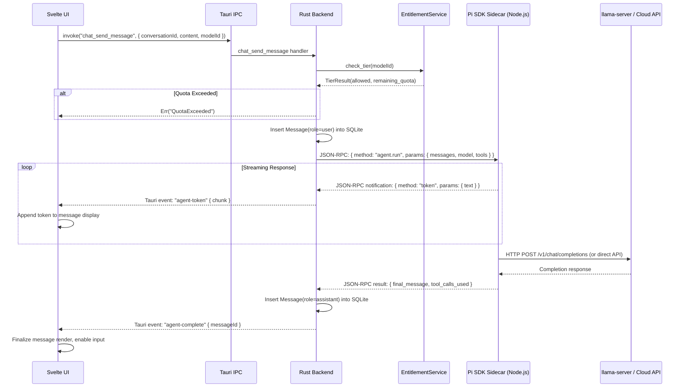

### 4.2 Knowledge Base Import Pipeline (F2)

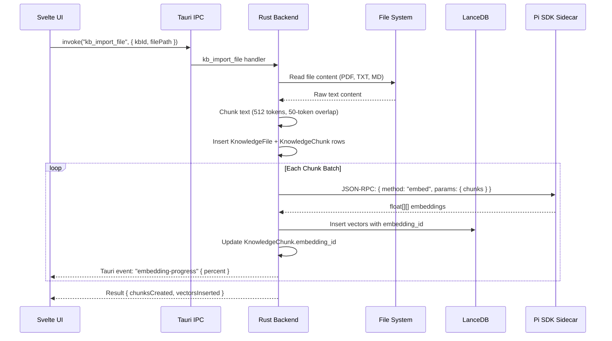

### 4.3 RAG Retrieval Flow (F2)

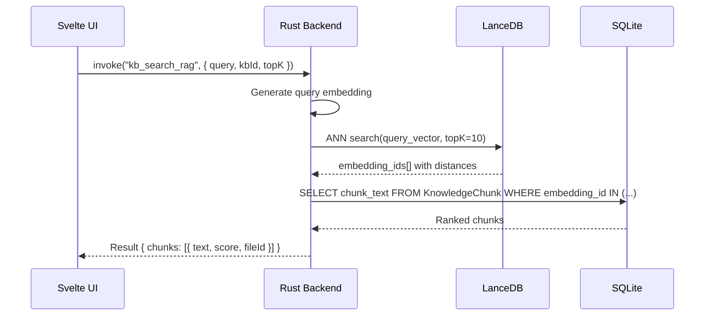

### 4.4 Knowledge Graph Entity Extraction (F3)

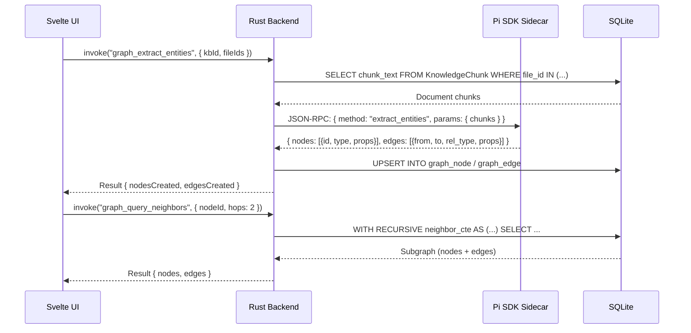

### 4.5 Agent Branching and Compaction (F4)

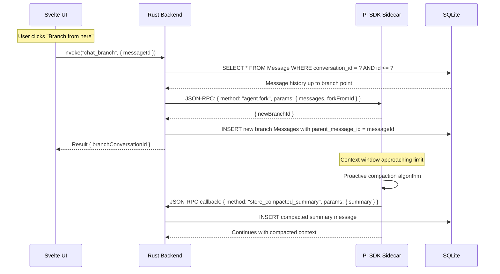

### 4.6 Skills Execution (F5)

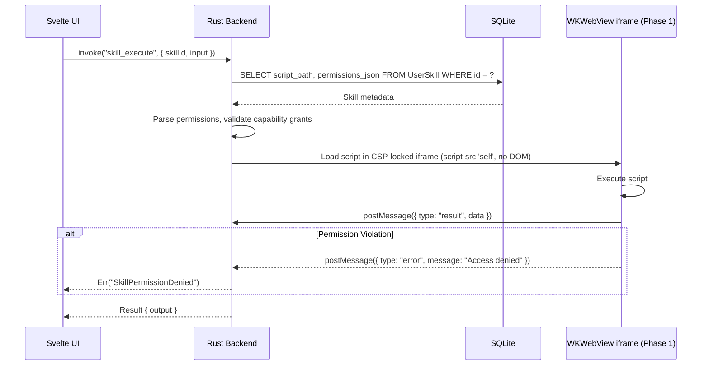

### 4.7 MCP Server Invocation (F6)

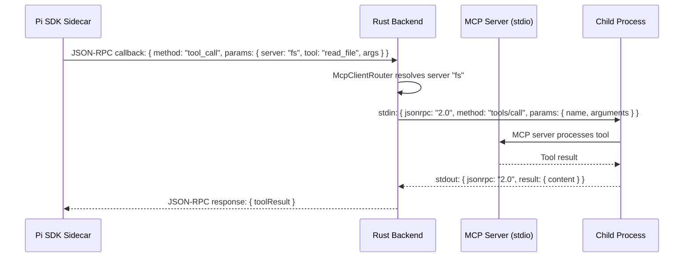

### 4.8 Browser Automation Scrape (F7)

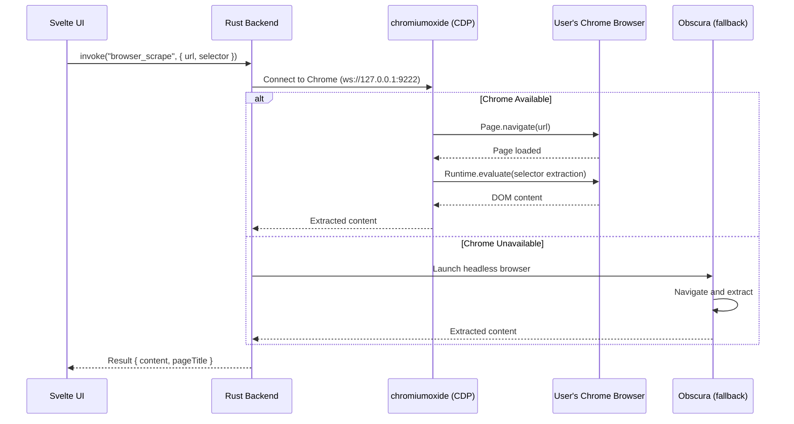

### 4.9 Entitlement Validation (F8)

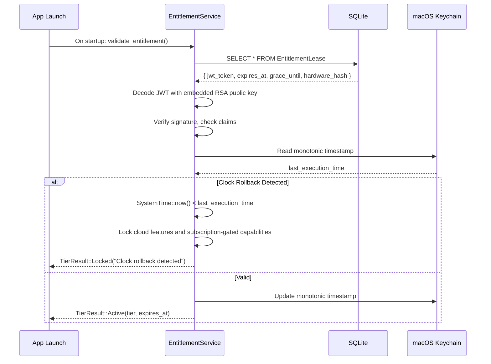

### 4.10 Backup Export / Import (F10)

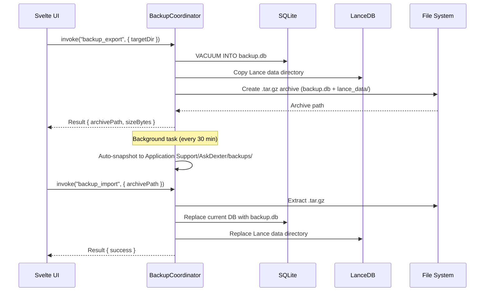

### 4.11 v1 Data Migration (F11)

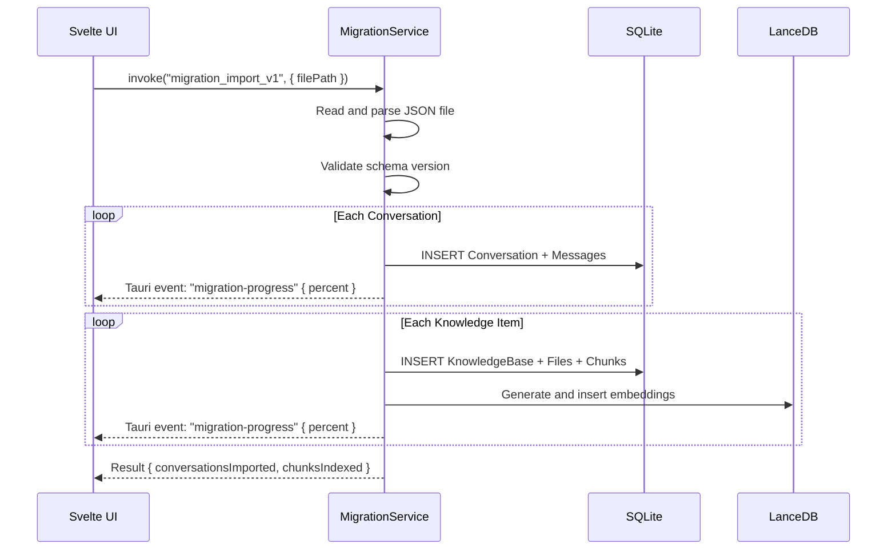

### 4.12 Local Model Download and Load (F12)

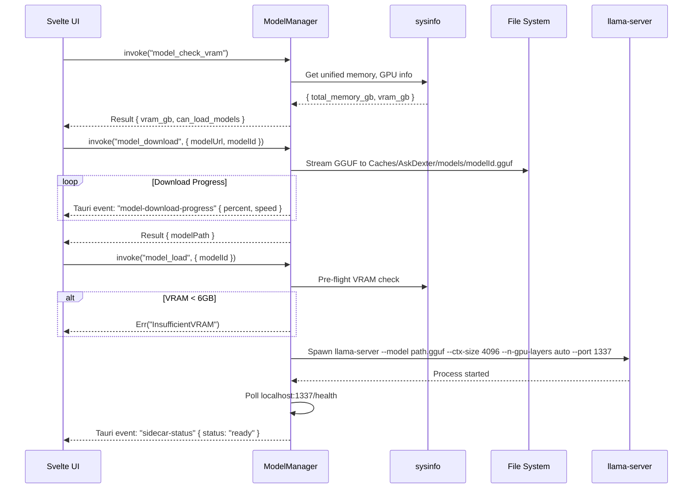


---


### 4.7 Projects as Session Contexts
In v2, Projects are not strictly parent containers of chats. A Project is defined as an isolated contextual workspace containing custom instructions, linked files, and specific settings. Individual Chat Sessions or Threads are attached to a Project. This allows the agent to inject the Project's context into the active session without forcing the user to navigate a rigid hierarchical folder structure.

## 5. IPC Command Catalog

All `#[tauri::command]` functions exposed by the Rust backend, organized by domain. Each entry specifies input parameters with Rust types, return type, validation rules, and error variants.

### 5.1 Chat / Conversation Commands (`chat_*`)

| Command | Parameters | Return | Validation | Async | Errors |
|---------|-----------|--------|-----------|-------|--------|
| `chat_send_message` | `conversation_id: String, content: String, model_id: String` | `Result<MessageId, AppError>` | content length ≤ 100,000 chars; model_id validated against entitlement tier | Yes | `QuotaExceeded`, `SidecarUnavailable`, `EntitlementLocked` |
| `chat_list_conversations` | `limit: u32, offset: u32` | `Result<Vec<Conversation>, AppError>` | limit ≤ 100 | No | `Database` |
| `chat_get_thread` | `conversation_id: String, branch_id: Option<String>` | `Result<Vec<Message>, AppError>` | conversation_id is UUID format | No | `Database`, `NotFound` |
| `chat_delete_conversation` | `conversation_id: String` | `Result<(), AppError>` | conversation_id is UUID format | No | `Database`, `NotFound` |
| `chat_branch` | `conversation_id: String, message_id: String` | `Result<String, AppError>` | Both IDs are UUID format | No | `Database`, `NotFound` |
| `chat_compact_history` | `conversation_id: String` | `Result<CompactionSummary, AppError>` | conversation_id is UUID format | Yes | `Database`, `SidecarUnavailable` |

### 5.2 Knowledge Base Commands (`kb_*`)

| Command | Parameters | Return | Validation | Async | Errors |
|---------|-----------|--------|-----------|-------|--------|
| `kb_create` | `name: String` | `Result<String, AppError>` | name length 1–200 chars | No | `Database` |
| `kb_import_file` | `kb_id: String, file_path: String` | `Result<ImportResult, AppError>` | file_path canonicalized and within accessible dirs; file exists; extension in allowed set (.pdf, .txt, .md, .docx) | Yes | `Io`, `UnsupportedFormat`, `Database` |
| `kb_list` | — | `Result<Vec<KnowledgeBase>, AppError>` | — | No | `Database` |
| `kb_delete` | `kb_id: String` | `Result<(), AppError>` | kb_id is UUID format | No | `Database`, `NotFound` |
| `kb_get_chunks` | `kb_id: String, file_id: Option<String>, limit: u32, offset: u32` | `Result<Vec<KnowledgeChunk>, AppError>` | limit ≤ 500 | No | `Database` |
| `kb_search_rag` | `query: String, kb_id: String, top_k: u32` | `Result<Vec<RagResult>, AppError>` | query length ≤ 2,000 chars; top_k ≤ 50 | Yes | `Database`, `VectorStoreUnavailable` |
| `kb_reindex` | `kb_id: String` | `Result<ReindexResult, AppError>` | kb_id is UUID format | Yes | `Database`, `SidecarUnavailable` |

### 5.3 Knowledge Graph Commands (`graph_*`)

| Command | Parameters | Return | Validation | Async | Errors |
|---------|-----------|--------|-----------|-------|--------|
| `graph_extract_entities` | `kb_id: String, file_ids: Vec<String>` | `Result<ExtractionResult, AppError>` | All IDs UUID format | Yes | `Database`, `SidecarUnavailable` |
| `graph_query_neighbors` | `node_id: String, hops: u32, rel_type: Option<String>` | `Result<Subgraph, AppError>` | hops ≤ 3 | No | `Database` |
| `graph_search_path` | `from_id: String, to_id: String, max_hops: u32` | `Result<Vec<GraphPath>, AppError>` | max_hops ≤ 3 | No | `Database` |
| `graph_add_node` | `node_type: String, properties: serde_json::Value` | `Result<String, AppError>` | properties ≤ 10KB JSON | No | `Database`, `Validation` |
| `graph_add_edge` | `from_id: String, to_id: String, rel_type: String, properties: serde_json::Value` | `Result<String, AppError>` | Both node IDs exist; properties ≤ 10KB | No | `Database`, `NotFound` |

### 5.4 Skills Commands (`skill_*`)

| Command | Parameters | Return | Validation | Async | Errors |
|---------|-----------|--------|-----------|-------|--------|
| `skill_list` | — | `Result<Vec<UserSkill>, AppError>` | — | No | `Database` |
| `skill_import` | `file_path: String, name: String, permissions: serde_json::Value` | `Result<String, AppError>` | file_path within accessible dirs; file is .js or .wasm; name 1–100 chars; permissions matches JSON Schema | No | `Io`, `Validation`, `Database` |
| `skill_execute` | `skill_id: String, input: serde_json::Value` | `Result<serde_json::Value, AppError>` | skill_id exists; input ≤ 1MB | Yes | `NotFound`, `PermissionDenied`, `ExecutionFailed` |
| `skill_delete` | `skill_id: String` | `Result<(), AppError>` | skill_id is UUID format | No | `Database`, `NotFound` |
| `skill_get_permissions` | `skill_id: String` | `Result<serde_json::Value, AppError>` | skill_id is UUID format | No | `Database`, `NotFound` |

### 5.5 MCP Server Commands (`mcp_*`)

| Command | Parameters | Return | Validation | Async | Errors |
|---------|-----------|--------|-----------|-------|--------|
| `mcp_list_servers` | — | `Result<Vec<McpServer>, AppError>` | — | No | `Database` |
| `mcp_add_server` | `name: String, transport: String, config: serde_json::Value` | `Result<String, AppError>` | transport ∈ {stdio, http}; config validated against MCP server JSON Schema | No | `Validation`, `Database` |
| `mcp_remove_server` | `server_id: String` | `Result<(), AppError>` | server_id is UUID format | No | `Database`, `NotFound` |
| `mcp_test_connection` | `server_id: String` | `Result<ConnectionStatus, AppError>` | server_id exists | Yes | `ConnectionFailed`, `Timeout` |
| `mcp_invoke_tool` | `server_id: String, tool_name: String, arguments: serde_json::Value` | `Result<serde_json::Value, AppError>` | server_id exists; tool_name matches server manifest | Yes | `ConnectionFailed`, `ToolNotFound`, `Timeout` |

### 5.6 Browser Commands (`browser_*`)

| Command | Parameters | Return | Validation | Async | Errors |
|---------|-----------|--------|-----------|-------|--------|
| `browser_navigate` | `url: String` | `Result<PageInfo, AppError>` | URL scheme ∈ {http, https}; URL parses successfully | Yes | `BrowserUnavailable`, `NavigationFailed` |
| `browser_scrape` | `url: String, selector: String` | `Result<ScrapeResult, AppError>` | URL valid; selector is valid CSS | Yes | `BrowserUnavailable`, `SelectorInvalid` |
| `browser_search` | `query: String, engine: Option<String>` | `Result<Vec<SearchResult>, AppError>` | query length ≤ 500 chars | Yes | `BrowserUnavailable`, `NetworkError` |
| `browser_screenshot` | `url: Option<String>` | `Result<Vec<u8>, AppError>` | URL valid if provided | Yes | `BrowserUnavailable` |

### 5.7 Entitlement Commands (`entitlement_*`)

| Command | Parameters | Return | Validation | Async | Errors |
|---------|-----------|--------|-----------|-------|--------|
| `entitlement_validate` | — | `Result<EntitlementStatus, AppError>` | — | No | `Database`, `KeychainAccess` |
| `entitlement_refresh` | `jwt_token: String` | `Result<EntitlementStatus, AppError>` | JWT decodes successfully | No | `InvalidToken`, `Database` |
| `entitlement_get_tier` | — | `Result<TierInfo, AppError>` | — | No | `Database` |
| `entitlement_check_feature` | `feature_id: String` | `Result<bool, AppError>` | feature_id matches known feature set | No | `Database` |

### 5.8 Settings Commands (`settings_*`)

| Command | Parameters | Return | Validation | Async | Errors |
|---------|-----------|--------|-----------|-------|--------|
| `settings_get` | `key: String` | `Result<Option<String>, AppError>` | key length 1–200 chars | No | `Database` |
| `settings_set` | `key: String, value: String` | `Result<(), AppError>` | key length 1–200 chars; value ≤ 10KB | No | `Database`, `Validation` |
| `settings_get_all` | — | `Result<HashMap<String, String>, AppError>` | — | No | `Database` |

### 5.9 Backup Commands (`backup_*`)

| Command | Parameters | Return | Validation | Async | Errors |
|---------|-----------|--------|-----------|-------|--------|
| `backup_export` | `target_dir: String` | `Result<BackupResult, AppError>` | target_dir exists and is writable; path canonicalized | Yes | `Io`, `Database` |
| `backup_import` | `archive_path: String` | `Result<RestoreResult, AppError>` | archive_path exists; file is valid .tar.gz; path canonicalized | Yes | `Io`, `CorruptArchive`, `Database` |
| `backup_list` | — | `Result<Vec<BackupInfo>, AppError>` | — | No | `Io` |

### 5.10 Model Management Commands (`model_*`)

| Command | Parameters | Return | Validation | Async | Errors |
|---------|-----------|--------|-----------|-------|--------|
| `model_list_available` | — | `Result<Vec<ModelInfo>, AppError>` | — | No | `NetworkError` (for catalog fetch) or static list |
| `model_download` | `model_url: String, model_id: String` | `Result<ModelPath, AppError>` | URL valid; model_id is alphanumeric | Yes | `NetworkError`, `Io`, `InsufficientDisk` |
| `model_delete` | `model_id: String` | `Result<(), AppError>` | model_id exists on disk | No | `Io`, `NotFound` |
| `model_load` | `model_id: String, ctx_size: Option<u32>` | `Result<SidecarStatus, AppError>` | model_id exists; ctx_size ≤ 32768 | Yes | `InsufficientVRAM`, `SidecarFailed` |
| `model_check_vram` | — | `Result<HardwareInfo, AppError>` | — | No | — |

### 5.11 Sidecar Control Commands (`sidecar_*`)

| Command | Parameters | Return | Validation | Async | Errors |
|---------|-----------|--------|-----------|-------|--------|
| `sidecar_status` | `name: String` | `Result<SidecarStatus, AppError>` | name ∈ {pi-sdk, llama-server} | No | — |
| `sidecar_restart` | `name: String` | `Result<SidecarStatus, AppError>` | name ∈ {pi-sdk, llama-server} | Yes | `SidecarFailed` |
| `sidecar_stop` | `name: String` | `Result<(), AppError>` | name ∈ {pi-sdk, llama-server} | No | — |

### 5.12 Migration Commands (`migration_*`)

| Command | Parameters | Return | Validation | Async | Errors |
|---------|-----------|--------|-----------|-------|--------|
| `migration_import_v1` | `file_path: String` | `Result<MigrationResult, AppError>` | file_path exists; file is valid JSON; schema version recognized | Yes | `Io`, `InvalidSchema`, `Database` |

---

## 6. Tauri Event Catalog

All events emitted by the Rust backend via `app.emit()` for streaming data to the Svelte frontend.

### 6.1 Agent Events

| Event Name | Payload Schema | Emitter | Frequency |
|-----------|---------------|---------|-----------|
| `agent-token` | `{ conversationId: string, messageId: string, chunk: string }` | PiSdkBridge | Per-token during streaming |
| `agent-complete` | `{ conversationId: string, messageId: string, tokenCount: number }` | PiSdkBridge | Once per completed turn |
| `agent-error` | `{ conversationId: string, error: string, recoverable: boolean }` | PiSdkBridge | On failure |
| `agent-tool-call` | `{ conversationId: string, toolName: string, arguments: object }` | PiSdkBridge | Per tool invocation |
| `agent-tool-result` | `{ conversationId: string, toolName: string, result: object }` | PiSdkBridge | Per tool result |

### 6.2 Embedding Events

| Event Name | Payload Schema | Emitter | Frequency |
|-----------|---------------|---------|-----------|
| `embedding-progress` | `{ kbId: string, percent: number, current: number, total: number }` | VectorStore | Per chunk batch |
| `embedding-complete` | `{ kbId: string, chunksIndexed: number }` | VectorStore | Once per import |
| `embedding-error` | `{ kbId: string, error: string, failedChunks: number }` | VectorStore | On failure |

### 6.3 Model Events

| Event Name | Payload Schema | Emitter | Frequency |
|-----------|---------------|---------|-----------|
| `model-download-progress` | `{ modelId: string, percent: number, speed: string, eta: string }` | ModelManager | Per download chunk |
| `model-download-complete` | `{ modelId: string, path: string, sizeBytes: number }` | ModelManager | Once per download |

### 6.4 Sidecar Events

| Event Name | Payload Schema | Emitter | Frequency |
|-----------|---------------|---------|-----------|
| `sidecar-status` | `{ name: string, status: "starting" \| "ready" \| "stopped" \| "crashed", pid?: number }` | PiSdkBridge / ModelManager | On state change |
| `sidecar-log` | `{ name: string, level: string, message: string }` | PiSdkBridge / ModelManager | Per log line (dev builds only) |

### 6.5 Backup Events

| Event Name | Payload Schema | Emitter | Frequency |
|-----------|---------------|---------|-----------|
| `backup-status` | `{ operation: "export" \| "import", status: string, percent?: number }` | BackupCoordinator | During operations |

### 6.6 Migration Events

| Event Name | Payload Schema | Emitter | Frequency |
|-----------|---------------|---------|-----------|
| `migration-progress` | `{ phase: string, percent: number, current: number, total: number }` | MigrationService | Per batch |

### 6.7 Settings Events

| Event Name | Payload Schema | Emitter | Frequency |
|-----------|---------------|---------|-----------|
| `settings-changed` | `{ key: string, value: string }` | DatabaseLayer | On settings update |

### 6.8 Entitlement Events

| Event Name | Payload Schema | Emitter | Frequency |
|-----------|---------------|---------|-----------|
| `entitlement-changed` | `{ tier: string, expiresAt?: string, locked: boolean }` | EntitlementService | On tier change or clock rollback detection |


---

## 7. Sidecar Process Management Specification

### 7.1 Pi SDK Node.js Sidecar

**Binary Path**: `Contents/Resources/sidecar/node` (bundled Node.js runtime ~40MB)
**Entry Point**: `Contents/Resources/sidecar/pi-sdk/index.js`

**Spawn Configuration:**
```rust
Command::new(node_path)
    .arg(pi_entry_path)
    .arg("--stdio")                    // JSON-RPC 2.0 mode
    .arg("--max-old-space-size=2048")  // Cap at 2GB RAM
    .stdin(Stdio::piped())
    .stdout(Stdio::piped())
    .stderr(Stdio::piped())
    .env("NODE_ENV", "production")
```

**JSON-RPC 2.0 Message Format:**

Request (Rust → Pi SDK):
```json
{
  "jsonrpc": "2.0",
  "id": 1,
  "method": "agent.run",
  "params": {
    "conversationId": "uuid",
    "messages": [{ "role": "user", "content": "..." }],
    "model": { "provider": "anthropic", "id": "claude-sonnet-4-20250514" },
    "tools": [{ "name": "read_file", "server": "filesystem" }]
  }
}
```

Notification (Pi SDK → Rust, streaming):
```json
{
  "jsonrpc": "2.0",
  "method": "agent.token",
  "params": { "conversationId": "uuid", "chunk": "Hello" }
}
```

Callback (Pi SDK → Rust, tool invocation):
```json
{
  "jsonrpc": "2.0",
  "id": 2,
  "method": "tool.call",
  "params": { "server": "filesystem", "tool": "read_file", "arguments": { "path": "/..." } }
}
```

**Lifecycle State Machine:**
```
Stopped → Starting → Running → Stopping → Stopped
                     ↓                        ↑
                   Crashed ─── Restarting ────┘
```

**Heartbeat**: PiSdkBridge sends `{ method: "ping" }` every 30 seconds. If no response within 10 seconds, sidecar is marked `Crashed` and auto-restarts (max 3 retries).

**Graceful Shutdown**: Send `{ method: "shutdown" }`, wait 5 seconds, then SIGTERM.

**Crash Recovery**: On unexpected exit, PiSdkBridge emits `sidecar-status { status: "crashed" }`, waits 2 seconds, auto-restarts. After 3 consecutive crashes, stops retrying and emits `agent-error` to UI.

### 7.2 llama-server Sidecar

**Binary Path**: `Contents/Resources/sidecar/llama-server` (pre-compiled, Metal-enabled)

**Spawn Configuration:**
```rust
Command::new(llama_server_path)
    .arg("--model").arg(model_file_path)
    .arg("--ctx-size").arg(ctx_size.to_string())   // default 4096
    .arg("--n-gpu-layers").arg("auto")              // Metal auto-detect
    .arg("--port").arg("1337")
    .arg("--host").arg("127.0.0.1")
    .stdout(Stdio::piped())
    .stderr(Stdio::piped())
```

**Health Check**: Poll `GET http://127.0.0.1:1337/health` every 500ms after spawn. Mark `Ready` after 3 consecutive 200 responses. Mark `Crashed` after 10 consecutive failures.

**VRAM Pre-Flight Check** (before spawn):
```rust
let memory = sysinfo::System::new_all();
let total_gb = memory.total_memory() / 1_073_741_824;
if total_gb < 6 { return Err(AppError::InsufficientVRAM); }
```

---

## 8. Database Access Layer

### 8.1 Connection Strategy

A single `rusqlite::Connection` wrapped in `tokio::sync::Mutex<AppDatabase>`, initialized once at app startup and shared across all Tauri commands via `tauri::State`.

```rust
pub struct AppState {
    pub db: Arc<Mutex<AppDatabase>>,
    pub lance: Arc<LanceConnection>,
    pub entitlement: EntitlementService,
    pub pi_bridge: Arc<PiSdkBridge>,
    pub model_manager: Arc<ModelManager>,
}
```

### 8.2 WAL Configuration (Applied on Open)

```sql
PRAGMA journal_mode = WAL;
PRAGMA wal_autocheckpoint = 1000;
PRAGMA synchronous = NORMAL;
PRAGMA foreign_keys = ON;
PRAGMA cache_size = -64000;  -- 64MB cache
PRAGMA busy_timeout = 5000;  -- 5 second busy timeout
```

### 8.3 Migration Runner

Numbered SQL files in `migrations/` directory, executed in order on app startup:
```
migrations/
  001_initial_schema.sql
  002_graph_tables.sql
  003_app_settings.sql
```

Each migration is wrapped in a transaction. A `schema_version` table tracks applied migrations.

### 8.4 LanceDB Table Management

LanceDB tables stored in `Application Support/AskDexter/lance/`. IVF-PQ index built on first insert and rebuilt when vector count exceeds 2x the training set size.

---

## 9. Error Handling and Circuit Breaker Patterns

### 9.1 Error Taxonomy

```rust
#[derive(Debug, Serialize)]
pub enum AppError {
    Database(String),
    Io(String),
    Validation(String),
    NotFound(String),
    SidecarUnavailable(String),
    SidecarFailed(String),
    VectorStoreUnavailable(String),
    BrowserUnavailable(String),
    NetworkError(String),
    EntitlementLocked(String),
    QuotaExceeded { remaining: u64 },
    InsufficientVRAM(String),
    InsufficientDisk(String),
    PermissionDenied(String),
    ExecutionFailed(String),
    InvalidToken(String),
    InvalidSchema(String),
    CorruptArchive(String),
    ConnectionFailed(String),
    ToolNotFound(String),
    Timeout(String),
    UnsupportedFormat(String),
    KeychainAccess(String),
    SelectorInvalid(String),
    NavigationFailed(String),
}
```

All errors serialize to JSON for IPC boundary: `{ "type": "AppError", "variant": "Database", "message": "..." }`.

### 9.2 Circuit Breaker

Applied to: Pi SDK sidecar communication, MCP server connections, browser CDP connections.

**States**: Closed (normal) → Open (after 3 consecutive failures) → HalfOpen (after 30s cooldown, allows 1 probe request) → Closed (if probe succeeds) or Open (if probe fails).

```rust
pub struct CircuitBreaker {
    state: Arc<Mutex<BreakerState>>,
    failure_threshold: u32,    // default: 3
    cooldown_secs: u64,        // default: 30
}
```

### 9.3 Retry Policy

Exponential backoff with jitter for transient failures (network errors, temporary sidecar unavailability):
- Base delay: 100ms
- Max delay: 5s
- Max retries: 3
- Jitter: ±25%

---

## 10. File System Layout

```
~/Library/Application Support/AskDexter/
├── askdexter.db                    # Primary SQLite database
├── askdexter.db-wal                # WAL file
├── askdexter.db-shm                # Shared memory file
├── lance/                          # LanceDB vector data
│   ├── knowledge_chunks.lance/
│   └── ...
├── backups/                        # Auto-snapshots (30-min interval)
│   ├── 2026-06-10T12-00-00.tar.gz
│   └── ...
├── config.json                     # Runtime configuration
└── skills/                         # Imported skill scripts
    ├── skill-uuid-1.js
    └── skill-uuid-2.wasm

~/Library/Caches/AskDexter/
├── models/                         # Downloaded GGUF model files
│   ├── llama-3.1-8b-q4.gguf
│   └── nomic-embed-text.gguf
├── embeddings-cache/               # Cached embedding results
└── browser-screenshots/            # Temporary screenshot storage

AskDexter.app/Contents/Resources/sidecar/
├── node                            # Bundled Node.js runtime (~40MB)
├── pi-sdk/                         # Pi SDK application
│   ├── index.js
│   ├── package.json
│   └── node_modules/
└── llama-server                    # Pre-compiled llama-server binary (Metal)
```

---

## 11. Observability Plan

### 11.1 Structured Logging

Using the `tracing` crate with JSON formatting and rotating file appender.

**Log File**: `~/Library/Logs/AskDexter/app.log`
**Max Size**: 50MB total (10MB per file, 5 rotated files)
**Levels**:
- `error`: Sidecar crashes, database failures, entitlement violations
- `warn`: Circuit breaker trips, retry attempts, VRAM warnings
- `info`: IPC command invocations, sidecar lifecycle events, backup operations
- `debug`: Full JSON-RPC message payloads, SQL queries (dev builds only)
- `trace`: Token-level streaming details (dev builds only)

### 11.2 Performance Metrics (Internal)

Tracked via `tracing` spans, exposed in dev-build debug panel:
- IPC command latency (p50, p95, p99 per command)
- Sidecar memory usage (sampled every 10s)
- Database query duration
- LanceDB search latency
- Token streaming throughput (tokens/second)

### 11.3 Crash Dumps

On panic, the `std::panic::set_hook` captures the backtrace and writes to `~/Library/Logs/AskDexter/crash-{timestamp}.log`. Sidecar crashes are logged with exit code and last 100 lines of stderr.

---

## 12. Security Model

### 12.1 Path Validation

All file system access through IPC commands uses canonicalized paths validated against the workspace root:
```rust
let canonical = std::fs::canonicalize(workspace_root.join(user_path))?;
if !canonical.starts_with(&workspace_root) {
    return Err(AppError::PermissionDenied("Path escape detected".into()));
}
```

### 12.2 macOS Keychain Access

Stored in Keychain:
- API keys (BYOK: Anthropic, OpenAI, Google)
- Monotonic execution timestamp (clock rollback detection)
- JWT token for current entitlement lease

NOT stored in Keychain (stored in SQLite):
- User preferences, conversation history, non-sensitive metadata

### 12.3 Skills Sandbox (Phase 1)

WKWebView iframe with Content Security Policy:
```
Content-Security-Policy: default-src 'none'; script-src 'self'; style-src 'self'; connect-src 'none';
```
- No DOM access to parent window
- No network access
- Only communication via `postMessage` bridge
- File system access restricted to workspace root (granted per-skill in `permissions_json`)

### 12.4 MCP Server Trust Model

- Stdio MCP servers: User must explicitly add via UI. Process spawned with no elevated privileges.
- HTTP MCP servers: URL validated against allowlist pattern (HTTPS preferred, HTTP localhost allowed for local servers).
- No MCP server can access the SQLite database directly.

### 12.5 Browser CDP Permissions

- CDP connections only to `127.0.0.1` (localhost) — no remote browser connections.
- User must have Chrome running with `--remote-debugging-port=9222`.
- Browser automation actions are logged. No credential harvesting from browser.

---

## 13. Phase Mapping and Dependencies

```
Phase 1 (Days 1-30): Foundations
├── Svelte 5 Shell + Layout
├── BrowserClient (CDP + Obscura)
├── SkillSandbox Phase 1 (WKWebView iframe)
└── State Stores + IPC Client

Phase 2 (Days 31-70): Local Stack
├── DatabaseLayer (rusqlite, migrations)
├── VectorStore (LanceDB)
├── GraphEngine (SQLite CTEs)
├── PiSdkBridge + Node.js sidecar
├── ModelManager + llama-server sidecar
└── EntitlementService + Keychain

Phase 3 (Days 71-90): Packaging & Polish
├── BackupCoordinator
├── MigrationService
├── McpClientRouter (full stdio + HTTP)
├── Apple Code Signing + Notarization
└── Performance tuning + crash reporting
```

**Dependency Graph:**
```
Phase 1 ──→ Phase 2 ──→ Phase 3
  │            │
  │            ├── DatabaseLayer required by: VectorStore, GraphEngine, BackupCoordinator, MigrationService
  │            ├── PiSdkBridge required by: ModelManager (embedding calls)
  │            └── EntitlementService required by: chat_send_message, model_download
  │
  └── Svelte Shell required by: All UI features in Phase 2-3
```

---

## 14. Appendices

### Appendix A: Full SQLite Schema DDL

```sql
-- Migration 001: Initial Schema

CREATE TABLE IF NOT EXISTS user (
    id TEXT PRIMARY KEY,
    email TEXT,
    premium_tier TEXT NOT NULL DEFAULT 'free',
    local_token_count INTEGER NOT NULL DEFAULT 0,
    last_sync DATETIME
);

CREATE TABLE IF NOT EXISTS conversation (
    id TEXT PRIMARY KEY,
    user_id TEXT NOT NULL REFERENCES user(id),
    title TEXT NOT NULL DEFAULT 'New Conversation',
    model_id TEXT,
    created_at DATETIME NOT NULL DEFAULT CURRENT_TIMESTAMP,
    updated_at DATETIME NOT NULL DEFAULT CURRENT_TIMESTAMP
);

CREATE TABLE IF NOT EXISTS message (
    id TEXT PRIMARY KEY,
    conversation_id TEXT NOT NULL REFERENCES conversation(id) ON DELETE CASCADE,
    parent_message_id TEXT REFERENCES message(id),
    role TEXT NOT NULL CHECK (role IN ('user', 'assistant', 'system', 'tool')),
    content TEXT NOT NULL,
    token_count INTEGER,
    model_id TEXT,
    created_at DATETIME NOT NULL DEFAULT CURRENT_TIMESTAMP
);

CREATE INDEX idx_message_conversation ON message(conversation_id);
CREATE INDEX idx_message_parent ON message(parent_message_id);

CREATE TABLE IF NOT EXISTS knowledge_base (
    id TEXT PRIMARY KEY,
    user_id TEXT NOT NULL REFERENCES user(id),
    name TEXT NOT NULL,
    created_at DATETIME NOT NULL DEFAULT CURRENT_TIMESTAMP
);

CREATE TABLE IF NOT EXISTS knowledge_file (
    id TEXT PRIMARY KEY,
    kb_id TEXT NOT NULL REFERENCES knowledge_base(id) ON DELETE CASCADE,
    file_path TEXT NOT NULL,
    file_hash TEXT,
    chunk_count INTEGER NOT NULL DEFAULT 0,
    created_at DATETIME NOT NULL DEFAULT CURRENT_TIMESTAMP
);

CREATE TABLE IF NOT EXISTS knowledge_chunk (
    id TEXT PRIMARY KEY,
    file_id TEXT NOT NULL REFERENCES knowledge_file(id) ON DELETE CASCADE,
    chunk_index INTEGER NOT NULL,
    chunk_text TEXT NOT NULL,
    embedding_id TEXT,
    token_count INTEGER
);

CREATE INDEX idx_chunk_file ON knowledge_chunk(file_id);
CREATE INDEX idx_chunk_embedding ON knowledge_chunk(embedding_id);

CREATE TABLE IF NOT EXISTS mcp_server (
    id TEXT PRIMARY KEY,
    user_id TEXT NOT NULL REFERENCES user(id),
    name TEXT NOT NULL,
    transport TEXT NOT NULL CHECK (transport IN ('stdio', 'http')),
    url TEXT,
    command TEXT,
    config_json TEXT,
    created_at DATETIME NOT NULL DEFAULT CURRENT_TIMESTAMP
);

CREATE TABLE IF NOT EXISTS user_skill (
    id TEXT PRIMARY KEY,
    name TEXT NOT NULL,
    script_path TEXT NOT NULL,
    sandbox_type TEXT NOT NULL DEFAULT 'iframe',
    permissions_json TEXT NOT NULL DEFAULT '{}',
    created_at DATETIME NOT NULL DEFAULT CURRENT_TIMESTAMP
);

CREATE TABLE IF NOT EXISTS entitlement_lease (
    id TEXT PRIMARY KEY,
    jwt_token TEXT NOT NULL,
    expires_at DATETIME NOT NULL,
    grace_until DATETIME,
    hardware_hash TEXT NOT NULL,
    last_validated DATETIME NOT NULL DEFAULT CURRENT_TIMESTAMP
);

-- Migration 002: Graph Tables

CREATE TABLE IF NOT EXISTS graph_node (
    id TEXT PRIMARY KEY,
    type TEXT NOT NULL,
    properties_json TEXT NOT NULL DEFAULT '{}',
    created_at DATETIME NOT NULL DEFAULT CURRENT_TIMESTAMP
);

CREATE INDEX idx_graph_node_type ON graph_node(type);

CREATE TABLE IF NOT EXISTS graph_edge (
    id TEXT PRIMARY KEY,
    from_id TEXT NOT NULL REFERENCES graph_node(id) ON DELETE CASCADE,
    to_id TEXT NOT NULL REFERENCES graph_node(id) ON DELETE CASCADE,
    rel_type TEXT NOT NULL,
    properties_json TEXT NOT NULL DEFAULT '{}',
    created_at DATETIME NOT NULL DEFAULT CURRENT_TIMESTAMP
);

CREATE INDEX idx_graph_edge_from ON graph_edge(from_id);
CREATE INDEX idx_graph_edge_to ON graph_edge(to_id);
CREATE INDEX idx_graph_edge_rel ON graph_edge(rel_type);

-- Migration 003: App Settings

CREATE TABLE IF NOT EXISTS app_settings (
    key TEXT PRIMARY KEY,
    value TEXT NOT NULL
);

-- Schema Version Tracking

CREATE TABLE IF NOT EXISTS schema_version (
    version INTEGER PRIMARY KEY,
    applied_at DATETIME NOT NULL DEFAULT CURRENT_TIMESTAMP
);
```

### Appendix B: JSON-RPC 2.0 Message Examples

**Agent Run Request:**
```json
// → Rust to Pi SDK
{
  "jsonrpc": "2.0",
  "id": "req-001",
  "method": "agent.run",
  "params": {
    "conversationId": "550e8400-e29b-41d4-a716-446655440000",
    "messages": [
      { "role": "system", "content": "You are a helpful assistant." },
      { "role": "user", "content": "Explain Rust ownership." }
    ],
    "model": { "provider": "local", "endpoint": "http://127.0.0.1:1337/v1" },
    "maxTokens": 2048
  }
}
```

**Streaming Token Notification:**
```json
// ← Pi SDK to Rust
{
  "jsonrpc": "2.0",
  "method": "agent.token",
  "params": {
    "conversationId": "550e8400-e29b-41d4-a716-446655440000",
    "chunk": "Ownership in Rust"
  }
}
```

**Tool Call Callback:**
```json
// ← Pi SDK to Rust (requesting tool execution)
{
  "jsonrpc": "2.0",
  "id": "tool-001",
  "method": "tool.call",
  "params": {
    "server": "filesystem",
    "tool": "read_file",
    "arguments": { "path": "/Users/dev/project/src/main.rs" }
  }
}

// → Rust to Pi SDK (tool result)
{
  "jsonrpc": "2.0",
  "id": "tool-001",
  "result": {
    "content": "fn main() {\n    println!(\"Hello\");\n}\n"
  }
}
```

### Appendix C: Recursive CTE for Graph Traversal

```sql
-- 2-hop neighbor query from a given node
WITH RECURSIVE neighbors AS (
    -- Base case: the starting node
    SELECT id, type, properties_json, 0 AS depth
    FROM graph_node
    WHERE id = ?1

    UNION ALL

    -- Recursive case: follow edges up to max depth
    SELECT gn.id, gn.type, gn.properties_json, n.depth + 1
    FROM graph_node gn
    JOIN graph_edge ge ON (ge.to_id = gn.id OR ge.from_id = gn.id)
    JOIN neighbors n ON (ge.from_id = n.id OR ge.to_id = n.id)
    WHERE n.depth < ?2  -- max hops (1-3)
      AND gn.id != n.id -- prevent self-loops
)
SELECT DISTINCT id, type, properties_json, depth
FROM neighbors
ORDER BY depth;
```
