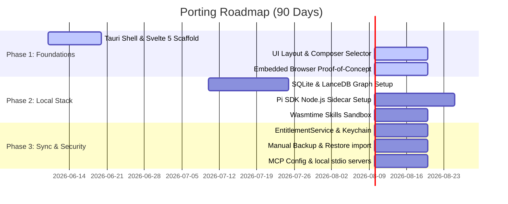

# Technical Specification: Porting Ask Dexter to macOS Native, Local-First Tauri Desktop Application

## 1. Executive Summary

This document specifies the technical architecture, design system references, implementation decisions, security models, and roadmap for porting **Ask Dexter** from a Next.js web application to a macOS-native, local-first, offline-capable desktop application using **Tauri v2**.

### Core Philosophy
* **Local-First by Default**: Data storage, vector embeddings, graph relationships, and LLM orchestration reside entirely on the local device. The application functions completely offline.
* **Opt-In Cloud Sync**: Cloud connectivity is an opt-in utility for remote backups or device synchronization, never a blocker for core app operation.
* **Tauri over Electron**: To minimize resource overhead, memory consumption, and bundle size, the app uses **Tauri v2** with a Rust-based system layer and a Svelte 5 reactive web frontend.

### High-Level Architecture
```
┌────────────────────────────────────────────────────────────────────────┐
│                        macOS native webview (WKWebView)                 │
│                 Svelte 5 UI Engine (Runes & State Modules)             │
└───────────────────▲────────────────────────────────▲───────────────────┘
                    │                                │
            Tauri IPC Commands (RPC)          Tauri Native Events (Streaming)
                    │                                │
┌───────────────────▼────────────────────────────────▼───────────────────┐
│                          Tauri Rust Backend                            │
│ ┌────────────────────────┐  ┌─────────────────────┐  ┌───────────────┐ │
│ │  EntitlementService    │  │   Backup/Import     │  │  Local DB     │ │
│ │  (JWT Validation,      │  │   Coordinator       │  │  (rusqlite +  │ │
│ │  Keychain integration) │  │   (Manual sync)     │  │  sqlite-vec)  │ │
│ └────────────────────────┘  └─────────────────────┘  └───────────────┘ │
│                                                                        │
│ ┌────────────────────────┐  ┌─────────────────────┐  ┌───────────────┐ │
│ │   Skills Sandbox       │  │  MCP Client Router  │  │  Pi SDK Rust  │ │
│ │   (Phase 1: iframe,   │  │  (stdio / HTTP)     │  │  Bridge       │ │
│ │    Phase 2: Wasmtime) │  │                     │  │               │ │
│ └────────────────────────┘  └─────────────────────┘  └───────────────┘ │
└───────────────▲──────────────────────────────────────────────▲─────────┘
                │ stdio (JSON-RPC)                             │ HTTP (1337)
┌───────────────▼──────────────────────────┐  ┌────────────────▼────────┐
│           Node.js Sidecar                │  │  llama-server Sidecar   │
│  - Pi SDK Core Execution Engine          │  │  - GGUF inference       │
└──────────────────────────────────────────┘  └─────────────────────────┘
```

---

## 2. Reference Repository Analysis

We synthesize architectural mechanics and design patterns from four leading open-source local-first AI workspaces:

### A. Project Structural Breakdown
* **janhq/jan**: Uses a multi-process architecture with a Tauri/Electron shell hosting a Rust/TypeScript extension system, communicating via custom plugins to a C++ sidecar (`Cortex.cpp` / `llama.cpp`) running on `localhost:1337`.
* **pewdiepie-archdaemon/odysseus**: Operates as a docker-compose web PWA. It leverages FastAPI + SQLAlchemy with SQLite, ChromaDB as a separate vector container, and SearXNG for web search.
* **openyak/openyak**: Utilizes Tauri v2 to wrap a Next.js 15 frontend, communicating with a Python/FastAPI backend and utilizing SQLite in WAL mode.
* **rowboatlabs/rowboat**: Monorepo split between Electron desktop renderer, Next.js web dashboard, and shared packages (`packages/core` and `packages/shared`).

### B. Feature Parity & Gap Analysis (Odysseus vs. Target App)

| Feature Category | Odysseus Implementation | Target Tauri App Specification | Architectural Gap / Action Required |
| :--- | :--- | :--- | :--- |
| **Desktop Integration** | Self-hosted Web PWA (Docker) | Native macOS Tauri App | Port Docker dependencies to native Rust crates; replace web wrapper with Tauri OS API hooks. |
| **Inference Integration** | Ollama / llama.cpp / Cloud APIs | Local llama-server sidecar | Integrate a local sidecar model manager; implement automated macOS hardware/unified VRAM detection. |
| **Relational Storage** | SQLite (Docker Volume mount) | Embedded SQLite (`rusqlite`) | Implement local SQLite DB inside macOS `Application Support` with WAL enabled. |
| **Vector Storage** | ChromaDB (Docker Service) | Embedded Vector Store (`sqlite-vec` or `LanceDB`) | Replace ChromaDB with an in-process, disk-based vector storage system for zero setup overhead. |
| **Knowledge Graph** | None (Flat Vector + Markdown Files) | SQLite Schema with recursive CTEs | Add entities, relations, and recursive GraphRAG traversal schemas directly inside SQLite. |
| **Client-Side Sync** | None (User-managed volume sync) | Manual backup/import + Loro CRDT | Build manual backup imports in Phase 1, deferring Loro CRDT synchronization to Phase 3. |
| **Browser Integration** | None (Relies on server-side scraping) | CDP-based Headless Browser Automation | Implement CDP automation client for agent scraping tasks without bundling heavy browser engines. |
| **Capabilities Sandbox** | Raw Shell Access (Unsafe) | Sandboxed WASM/Wasmtime Skills Engine | Build a secure capability-restricted script execution runtime. |

### C. Rowboat UI Anti-Patterns to Avoid
1. **Unshared UI Duplication**: Rowboat contains three separate frontend apps that recreate components. We enforce a strict shared UI layer in Svelte 5.
2. **Prop-Drilling & Context Abuse**: Global state is passed down manually or through React Context, causing double renders. We use Svelte 5 reactive Runes and store modules instead of React state managers like Zustand.
3. **No Virtualization in Chat**: Long chat threads stutter because the entire DOM is rendered. We mandate virtualization for the message container.
4. **Desktop-First Retrofitted for Mobile**: Spacing uses ad-hoc Tailwind classes (`p-2`, `p-3`) without a design token system. We enforce a 4px-grid spacing system.
5. **No Accessibility Outlines**: Focus states are stripped via `outline-none` with no keyboard fallback. We mandate accessible keyboard-focus rings.

---

## 3. Architecture Decision Records (ADRs)

### ADR-001: Frontend Framework & State Management Choice
* **Status**: Approved
* **Context**: The desktop shell must run inside Tauri's WKWebView. Memory usage, production bundle size, and rendering overhead directly determine cold-start times and overall responsiveness.
* **Decision**: We select **Svelte 5** (Runes) as the primary frontend framework and reject Zustand. All state management is handled using native Svelte runes (`$state`, `$derived`) and local Svelte state modules.
* **Rationale**:
  * **React Library Elimination**: Zustand is built on React hooks (`useSyncExternalStore`) and does not compile or work with Svelte. Svelte 5's native runes replace the need for an external state manager.
  * **Bundle Size & Memory**: Svelte 5 compiles to minimal JS (~8-10 KB gzipped) vs. React (~45 KB). It eliminates the Virtual DOM, keeping frontend memory usage under 30MB.
  * **AI Code Generation**: Svelte 5's signal-like runes (`$state`, `$derived`) are highly structured, reducing LLM code-generation errors compared to React hooks.

---

### ADR-002: Local Vector Store Selection
* **Status**: Approved
* **Context**: RAG tasks require semantic chunk matching. The vector store must run embedded in Rust, support macOS ARM64 SIMD hardware acceleration, and require zero setup from the user.
* **Decision**: We select **LanceDB** via the native Rust `lancedb` crate, with `sqlite-vec` as a fallback.
* **Rationale**:
  * **Rust Integration**: Native `lancedb` crate operates directly within the Tauri binary without requiring a separate server process.
  * **SIMD & GPU Acceleration**: On Apple Silicon, LanceDB leverages Metal (MPS) for training indexes, showing 15-20x speedup over CPU-only vector computations.
  * **Milvus Lite Exclusion**: Milvus Lite has no Rust SDK, making it unusable in our Tauri backend.

---

### ADR-003: Knowledge Graph Technology
* **Status**: Approved
* **Context**: For entity extraction and GraphRAG operations, we require a property graph database. KùzuDB was archived in late 2025 and LadybugDB is in early pre-1.0 development.
* **Decision**: We use a custom graph schema implemented directly in our primary **SQLite** database using recursive CTEs. LadybugDB is demoted to a Phase 2 research item.
* **Rationale**:
  * **Ecosystem Simplicity**: Standard SQLite handles graph structures via self-referential tables (`graph_node` and `graph_edge`) and recursive CTEs for up to 3 hops without significant performance degradation.
  * **Zero Dependency Overhead**: Avoids introducing pre-1.0 C++ graph bindings (`lbug` crate) during Phase 1.

---

### ADR-004: Embedded Browser Strategy
* **Status**: Approved
* **Context**: For agent search, scraping, and user-initiated web automation, the agent requires a browser interface. Bundling Chromium Embedded Framework (CEF) adds 200MB+ to the binary and complicates macOS signing.
* **Decision**: We use **CDP (Chrome DevTools Protocol)** via the Rust `chromiumoxide` crate to connect to the user's existing Chrome browser, with **Obscura** (a lightweight Rust-native headless browser) as the offline fallback.
* **Rationale**:
  * **WKWebView Limitations**: The app's main window runs in WKWebView, but Apple restricts executing automated scripts or headless browser commands in it.
  * **Zero Bundle Overhead**: Connecting to an existing Chrome installation via CDP keeps the Tauri installer tiny (~15MB).

---

### ADR-005: Sync & Client-Side Conflict Resolution
* **Status**: Approved
* **Context**: Multiple local-first instances must sync state. CRDTs add implementation complexity and consistency risks during initial development.
* **Decision**: Defer `Loro` CRDT multi-device sync to Phase 3. Phase 1 implements a manual import/export mechanism (SQLite database backup + LanceDB vector snapshot to a user-chosen directory) acting as local backups.
* **Rationale**:
  * **Fewer Failure Modes**: Focuses Phase 1 on local stability without the complexity of CRDT conflict resolution.
  * **Cloud Backups**: Users can sync data by exporting backups to cloud-backed folders (e.g. iCloud, Dropbox).

---

### ADR-006: Offline-First Subscription & Entitlement Model
* **Status**: Approved
* **Context**: Subscriptions must be validated without constant internet check-ins.
* **Decision**: We use a Rust-based `EntitlementService` performing **offline JWT validation** with a compile-time embedded RSA public key.
* **Entitlement Gating Matrix**:
  * **Free Tier**: Cloud Models limited (100k tokens/mo via proxy); Local Model download blocked; BYOK blocked.
  * **Paid Subscription**: Cloud Models high quota; Local Model download blocked; BYOK unlocked (keys saved in macOS Keychain).
  * **One-Time Purchase**: Cloud Models N/A; Local Model download permanently unlocked; BYOK N/A.
* **Grace Period**: A 7-day grace period is allowed if the app is offline when subscription expires.

---

### ADR-007: Local Agent Runtime Integration Architecture
* **Status**: Approved
* **Context**: Complex developer tasks require non-destructive branching, history tracking, and context compaction.
* **Decision**: We run the **Pi SDK** (`@earendil-works/pi-coding-agent`) inside a **Node.js sidecar process** managed by Tauri.
* **Rationale**:
  * **Pragmatic v1 Integration**: Pi SDK is written in TypeScript and runs on Node.js. Spawning it as a sidecar process avoids rewriting a complex agent SDK in Rust from scratch for Phase 1.
  * **Communication Protocol**: Rust communicates with the Node.js sidecar via JSON-RPC 2.0 over standard input/output (stdio). The Svelte UI calls Tauri Rust commands, which forward calls to the Node.js process and route updates back to the UI via native Tauri events.

---

### ADR-008: Database Architecture & Tauri SQL Plugin Exclusion
* **Status**: Approved
* **Context**: Data must be stored locally. Exposing SQL to the frontend via `tauri-plugin-sql` introduces dual pool management and potential WAL locking conflicts with direct Rust access.
* **Decision**: We exclude `tauri-plugin-sql` and manage all database access directly inside Rust using `rusqlite` (with the `bundled` feature).
* **Rationale**:
  * **Single Point of Authority**: The Svelte frontend reads/writes database state exclusively by invoking Tauri Rust commands.
  * **Conflict Avoidance**: Prevents SQLite file access collisions between the frontend SQL client and the Rust backend.

---

## 4. Local-First Data Model (ER Diagram)

This Entity-Relationship diagram represents the local SQLite schema managed by `rusqlite`.

```
+───────────────────────────+
│           User            │
│  - id: TEXT (PK)          │
│  - email: TEXT            │
│  - premium_tier: TEXT     │
│  - local_token_count: INT │◄────────┐
│  - last_sync: DATETIME    │         │
+─────────────┬─────────────+         │
              │                       │
              ├───────────────────────┼───────────────────────┬───────────────────────┐
              │ 1                     │ 1                     │ 1                     │ 1
              ▼ 0..*                  ▼ 0..*                  ▼ 0..*                  ▼ 0..*
+───────────────────────────+ +───────────────────────────+ +───────────────────────────+ +───────────────────────────+
│         Project           │ │       KnowledgeBase       │ │         McpServer         │ │       Conversation        │
│  - id: TEXT (PK)          │ │  - id: TEXT (PK)          │ │  - id: TEXT (PK)          │ │  - id: TEXT (PK)          │
│  - user_id: TEXT (FK)     │ │  - user_id: TEXT (FK)     │ │  - user_id: TEXT (FK)     │ │  - user_id: TEXT (FK)     │
│  - name: TEXT             │ │  - name: TEXT             │ │  - name: TEXT             │ │  - project_id: TEXT (FK)  │
│  - instructions: TEXT     │ +─────────────┬─────────────+ │  - url: TEXT              │ │  - title: TEXT            │
+─────────────┬─────────────+               │               │  - transport: TEXT (stdio)│ │  - model_id: TEXT         │
              │                             │ 1             │  - config_json: TEXT      │ +─────────────┬─────────────+
              │ 1                           ▼ 0..*          +───────────────────────────+               │
              │                       +───────────────────────────+                                     │ 1
              │                       │       KnowledgeFile       │                                     ▼ 0..*
              └─────────────────────► │  - id: TEXT (PK)          │                       +───────────────────────────+
                                      │  - kb_id: TEXT (FK)       │                       │          Message          │
                                      │  - file_path: TEXT        │                       │  - id: TEXT (PK)          │
                                      +─────────────┬─────────────+                       │  - conversation_id: (FK)  │
                                                    │                                     │  - parent_message_id: TEXT│
                                                    │ 1                                   │    (For Pi branching tree)│
                                                    ▼ 0..*                                │  - role: TEXT             │
                                      +───────────────────────────+                       │  - content: TEXT          │
                                      │      KnowledgeChunk       │                       +───────────────────────────+
                                      │  - id: TEXT (PK)          │
                                      │  - file_id: TEXT (FK)     │
                                      │  - chunk_text: TEXT       │
                                      │  - embedding_id: TEXT     │◄─── (Linked to LanceDB
                                      +───────────────────────────+      vector table)
```

### Specialized Local Tables

```
+───────────────────────────+     +───────────────────────────+
│        UserSkill          │     │        GraphNode          │
│  - id: TEXT (PK)          │     │  - id: TEXT (PK)          │
│  - name: TEXT             │     │  - type: TEXT             │
│  - script_path: TEXT      │     │  - properties_json: TEXT  │
│  - sandbox_type: TEXT     │     +─────────────┬─────────────+
│  - permissions_json: TEXT │                   │ 1
+───────────────────────────+                   ▼ 0..*
+───────────────────────────+     +───────────────────────────+
│     EntitlementLease      │     │        GraphEdge          │
│  - id: TEXT (PK)          │     │  - from_id: TEXT (FK)     │
│  - jwt_token: TEXT        │     │  - to_id: TEXT (FK)       │
│  - expires_at: DATETIME   │     │  - rel_type: TEXT         │
│  - grace_until: DATETIME  │     │  - properties_json: TEXT  │
│  - hardware_hash: TEXT    │     +───────────────────────────+
+───────────────────────────+
+───────────────────────────+
│        AppSettings        │
│  - key: TEXT (PK)         │
│  - value: TEXT            │
+───────────────────────────+
```

---

## 5. Component Architecture & State Flow

```
                     ┌───────────────────────────────┐
                     │       Tauri Main Window       │
                     │          (WKWebView)          │
                     └───────────────┬───────────────┘
                                     │
             ┌───────────────────────┴───────────────────────┐
             ▼                                               ▼
┌───────────────────────────────┐               ┌───────────────────────────────┐
│     Sidebar Component         │               │     Main Workspace Area       │
│  - 5 Primary Tabs             │               │  - Split Workspace (Top)      │
│    (Chat, Agent, Notes, Work, │               │  - Bottom Terminal (Bottom)   │
│     Playground)               │               └───────────────┬───────────────┘
│  - Contextual Sub-navigation  │                               │
└───────────────────────────────┘             ┌─────────────────┴─────────────────┐
                                              ▼                                   ▼
                               ┌─────────────────────────────┐     ┌─────────────────────────────┐
                                │     Active Chat Surface     │     │        Canvas Panel         │
                                │  - Chat view & Composer     │     │  - Artifacts List Tab       │
                                │  - Secondary page views     │     │  - Dynamic Preview Tabs     │
                                │    (Memories, Graph, Skills,│     │  - Collaborative Editor     │
                                │     Connectors, AI Hub, etc)│     │  - Embedded Browser Tab     │
                               └──────────────┬──────────────┘     └─────────────────────────────┘
                                              │
                                              ▼  (Tauri IPC Command: invoke("run_agent"))
                               ┌─────────────────────────────┐
                               │    Rust Backend Layer       │
                               │  - EntitlementService       │
                               │  - Pi SDK Bridge (stdio)    │
                               │  - Skill Sandbox Manager    │
                               └─────────────────────────────┘
```

### Communication Flow
* **State Updates**: Managed locally on the frontend inside Svelte 5 reactive stores.
* **Commands**: Frontend invokes `invoke("command_name", { args })` to run system functions in Rust.
* **Streams**: The Rust backend uses Tauri events (`app.emit("agent-token", chunk)`) to stream token outputs to the frontend, avoiding the network overhead of Server-Sent Events (SSE).

---

## 6. Tauri IPC Input Validation

Every `#[tauri::command]` entry point validates inputs at the Rust boundary to prevent security escapes.

```rust
#[tauri::command]
async fn read_workspace_file(path: String, state: tauri::State<'_, AppState>) -> Result<String, String> {
    // 1. Path Canonicalization & Boundary Verification
    let workspace_root = std::fs::canonicalize(&state.workspace_root)
        .map_err(|e| e.to_string())?;
    
    let target_path = std::fs::canonicalize(workspace_root.join(path))
        .map_err(|e| e.to_string())?;
    
    if !target_path.starts_with(&workspace_root) {
        return Err("Access Denied: Path escape detected".into());
    }

    // 2. Read File
    std::fs::read_to_string(target_path).map_err(|e| e.to_string())
}
```

### Validation Strategy
* **Paths**: All file-system access must canonicalize paths and verify they reside within the user's active workspace directory root.
* **User Queries**: System command strings are length-limited and validated before being passed to external tool commands.
* **MCP Configurations**: Raw configuration inputs are validated against JSON Schema definitions.
* **Error Handling**: Panics are caught at the boundary and returned as structured JSON error responses rather than causing app crashes.

---

## 7. Migration Strategy: v1 to v2

### Philosophy
* **Clean Slate**: Ask Dexter v2 desktop is a privacy-first, local-first product. To preserve user privacy, there is no automatic migration or syncing of cloud-hosted databases (e.g. Supabase, PostgreSQL) to the local machine.
* **JSON Export/Import**: Users who wish to migrate data from the v1 web application can export their conversations and settings as a standard JSON file.
* **Local Ingestion**: The Tauri Rust backend provides an `import_v1_data` command that parses the exported JSON, populates the local SQLite database, and indexes relevant document chunks into LanceDB.

---

## 8. Risk Assessment

### R1: WKWebView Browser Rendering Differences
* **Risk**: Layout inconsistencies compared to Chrome.
* **Mitigation**: Standardize on Tailwind CSS layouts. Do not write nested layouts exceeding three flexbox containers. Use WebKit-specific CSS prefixes for scrollbars.

### R2: Local Inference Resource Exhaustion (Memory Pressure)
* **Risk**: Loading massive GGUF models on low-RAM systems causing system freeze.
* **Mitigation**: Rust checks total memory (via `sysinfo`) and unified VRAM on boot. Hard-block model loading if VRAM is less than 6GB. Default to CPU threads dynamically if unified memory is overallocated.

### R3: JWT Tampering & Clock Rollback
* **Risk**: User changes system time to bypass offline grace periods or subscription end dates.
* **Mitigation**: Store a secure execution log timestamp in the macOS Keychain using the `security-framework` crate. Validate that `SystemTime::now()` is greater than the last recorded execution timestamp. If clock rollback is detected, lock cloud features and subscription-gated capabilities.

### R4: Local Code Execution Safety in Skills
* **Risk**: User-imported or AI-generated scripts deleting directories or executing shell exploits on the host OS.
* **Mitigation**: Execute user scripts inside a capability-isolated **Wasmtime Sandbox**. Deny file system and network access by default. Expose only limited, safe system APIs (e.g. read/write to active workspace root folder).

### R5: Context Window Degradation in Long Tasks
* **Risk**: Horizontal agent developer tasks exceeding context length, leading to memory loss or hallucination.
* **Mitigation**: Apply the Pi SDK proactive compaction algorithm. Condense past conversation history into compact structured logs, keeping active prompt buffers below 40% of the total context window.

### R6: Sync Failures & Database Corruption
* **Risk**: Hard shut down corrupting SQLite file or resulting in sync state mismatch.
* **Mitigation**: Enable SQLite WAL mode with `PRAGMA wal_autocheckpoint=1000`. Periodic automatic backup snapshots written to `Application Support/AskDexter/backups/` every 30 minutes via a Rust background task.

### R7: Keychain Permission Popups
* **Risk**: macOS prompting authorization alerts to the user during background keychain read/writes.
* **Mitigation**: Set clear access control labels in `security-framework`. Store only static user credentials (API keys) in Keychain, keeping non-sensitive metadata in the SQLite DB.

---

## 9. Dependency Inventory

### Rust Crates (`Cargo.toml`)
* `tauri = { version = "2.11.2", features = ["wry", "compression", "macos-private-api"] }`
* `rusqlite = { version = "0.40.0", features = ["bundled"] }`
* `lancedb = "0.15.0"` (Metal vector search support)
* `security-framework = "3.7.0"` (macOS Keychain bindings)
* `wasmtime = "45.0.1"` (Sandboxed execution)
* `jsonwebtoken = { version = "10.4.0", features = ["aws_lc_rs"] }`
* `chromiumoxide = "0.8.0"` (CDP client)
* `sysinfo = "0.39.3"` (VRAM/RAM detection)
* `serde = { version = "1.0", features = ["derive"] }`
* `serde_json = "1.0"`
* `tokio = { version = "1.52.3", features = ["full"] }`

### npm Packages (`package.json`)
* `svelte = "^5.0.0"`
* `@earendil-works/pi-coding-agent = "^1.2.0"`
* `@modelcontextprotocol/sdk = "^1.0.1"`
* `monaco-editor = "^0.52.0"`
* `lucide-svelte = "^1.17.0"`

---

## 10. Phase-by-Phase Technical Instructions

### Phase 1: Reference Repo Analysis & Styling Setup
* Extract layout variables from Jan and map design tokens to Svelte CSS properties.
* Construct the split-pane workspace (Chat on the left, Canvas on the right) with Svelte 5.
* Configure custom focus outlines and screen-reader `aria-label` tags for all action components.

### Phase 2: Embedded Database & Local Storage Stack
* Configure `rusqlite` with Write-Ahead Logging (WAL) enabled.
* Set up LanceDB with an IVF-PQ index on vector data columns.
* Write recursive CTE SQLite helpers to fetch graph relationships from `graph_node` and `graph_edge` tables.

### Phase 3: Offline Entitlements & macOS Keychain
* Write `EntitlementService` in Rust.
* Embed the server's public RSA key into the binary via `include_bytes!`.
* Implement the clock rollback verification handler running on Tauri app start.

### Phase 4: Local Runtime, Skills, & MCP Panel
* Build the skills sandbox (Phase 1: WKWebView iframe with CSP lockdown; Phase 2: Wasmtime engine migration).
* Build the double-pane MCP Configuration Panel in Svelte, interfacing with local stdio servers.
* Implement the bottom-anchored workspace selector bar inside the chat composer.

### Phase 5: Cloud Sync & macOS Packaging
* Package using `cargo tauri build` and generate Apple Developer Code Signing and Notarization records.

---

## 11. 90-Day Implementation Roadmap


